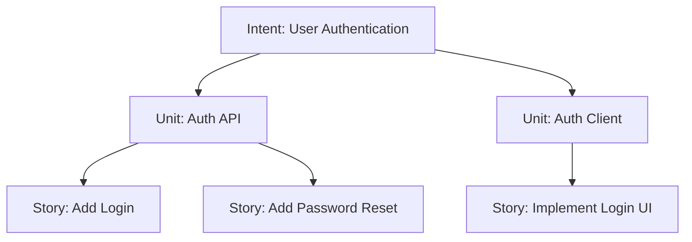
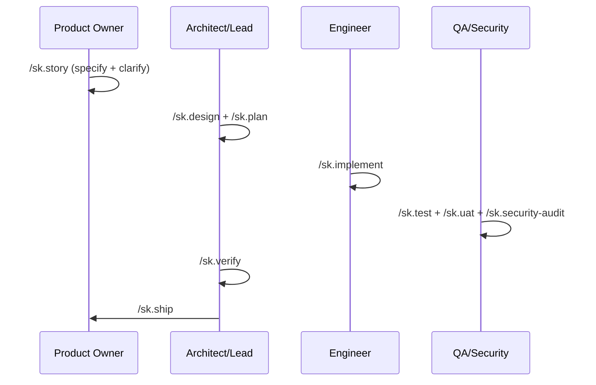

# 🚀 SpecKit-SSD-SDLC

> A spec-driven development framework for full-stack multi-service systems.

---

## 🎯 What This Is

**SpecKit-SSD-SDLC** gives a team of AI agents—and the humans working with them—a shared, structured process for going from business intent to working code.

It enforces:
- A hierarchy of artifacts (Intent → Unit → Story)
- A team-based session model with role-specific agents
- Adaptive quality checkpoints
- A full SDLC workflow from specification through implementation and verification

It natively supports both **Claude Code** and **Google Antigravity (Gemini)** via the `.claude/` command layer.

---

## ⚡ Quick Start: How To Use It

### 1. Initialize your project

> **🔧 Optional dependency:** [garrytan/gstack](https://github.com/garrytan/gstack) enhances three commands when installed:
> - `sk.review` and `sk.investigate` — run natively without gstack; gstack adds supplementary signal if present
> - `sk.ship` — falls back to `gh pr create` without gstack (requires [GitHub CLI](https://cli.github.com/))
> gstack's primary value is for **frontend** work: visual mockup generation (`/design-shotgun`), HTML conversion, and real browser testing via **sk.uat**.

SpecKit is designed to be added as a **git subtree** to any project repository.

```bash
git subtree add --prefix=.speckit https://github.com/ajorobert/SpecKit-SSD-SDLC master --squash
bash .speckit/setup.sh
/sk.init    # interactive interview → generates framework memory files
```

### 2. Start a session

Begin your work by adopting a persona (role shorthands: `po`, `architect`, `lead`, `backend`, `frontend`, `backend-qa`, `frontend-qa`, `security`):

```bash
/sk.session start --role po
```

> **🎭 Role Mapping:**
> - `po` $\rightarrow$ `po.md`
> - `architect` $\rightarrow$ `architect.md`
> - `lead` $\rightarrow$ `lead.md`
> - `backend` $\rightarrow$ `backend-engineer.md`
> - `frontend` $\rightarrow$ `frontend-engineer.md`
> - `backend-qa` $\rightarrow$ `backend-qa.md`
> - `frontend-qa` $\rightarrow$ `frontend-qa.md`
> - `security` $\rightarrow$ `security.md`

> **🏁 Ending your session:** 
> When your work is done, run `/sk.session end` to autonomously save state, commit, push your branch, and open your Pull Request.

> **🔁 Recovering a lost session:**
> If `session.yaml` is accidentally deleted while on an active branch, run `/sk.session restore` — it reconstructs the session from the current branch name without creating a new branch. Then run `/sk.session focus --story {id}` to re-lock your active story context.

### 3. Understand the Hierarchy & Session Focus

SpecKit organizes work into a strict top-down structure:
- **Intent**: A high-level business goal or feature (e.g., *User Authentication*).
- **Unit**: A specific technical bounded context or service (e.g., *Auth API*).
- **Story**: A single developer task or atomic slice of work (e.g., *Add password reset endpoint*).



**How do commands know what to work on?**
You use `/sk.session focus` to lock your agent onto a specific level. SpecKit saves this in a local `.claude/session.yaml` file. Every `/sk.*` command automatically reads this file, so the agent intrinsically knows which story or unit it is modifying without you having to repeatedly specify it.

**How do you move from Intent to Story?**
1. Run `/sk.story` on an **Intent**—the agent will autonomously decompose it into **Units** and **Stories**, and loop through clarification until the output meets completeness requirements.
2. Shift your focus downward using your session to execute the actual technical work:

```bash
/sk.session focus --intent user-auth               # Focus high-level for /sk.impact
/sk.session focus --unit auth-api                  # Shift focus downward for /sk.architecture
/sk.session focus --story story-AUTH-API-001       # Shift focus to the exact ticket for /sk.plan and /sk.implement
```

> **💡 Where do these names come from?**
> The `/sk.story` command automatically generates these tracking IDs, names, and their corresponding markdown files under `specs/intents/` when you outline and decompose work. 
> 
> **📊 How do I check story statuses?**
> Run `/sk.session list` to get a live dashboard view of all stories and their current workflow phase (e.g., `draft`, `in-progress`, `review`, `done`).

### 4. Run the SDLC



Commands marked `[optional]` are skippable. Commands marked `[conditional]` are required only in certain cases. Everything else is mandatory.

```
── SPECIFY ──────────────────────────────────────────────────────────────────────
/sk.story                ← capture intent → units → stories; ensures completeness via clarify loop (po)
                           --bug flag: bug report framing (expected/actual/repro) instead of user story
/sk.story --specify      ← [targeted] run Capture phase only: interview matrix → decomposition (po)
/sk.story --clarify      ← [targeted] run Clarify loop: resolves ambiguities via architect/po (architect/lead)
[/sk.impact]             ← [optional] assess blast radius on existing services (architect)

── ARCHITECTURE ─────────────────────────────────────────────────────────────────
/sk.design               ← full design pipeline: architecture → data model → API contracts (architect)
                           [conditional: runs based on unit stories and checkpoint mode]
[/sk.adr]                ← [optional] record a significant architecture decision (architect)

── PLAN ─────────────────────────────────────────────────────────────────────────
/sk.plan                 ← unit-level technical implementation plan and cross-story analysis (lead)
[/sk.knowledge-base]     ← [optional] generate or update knowledge base tiers (architect)

── FAST TRACK ───────────────────────────────────────────────────────────────────
[/sk.ff]                 ← sk.story→architecture→plan in one shot (lead)
                           --bug flag: skips architecture step; runs sk.story --bug instead
[/sk.hotfix]             ← P0 incident fast path: plan→implement→ship (lead)

── IMPLEMENT ────────────────────────────────────────────────────────────────────
/sk.implement            ← define tasks and execute implementation phase-by-phase (backend/frontend)
[/sk.investigate]        ← [optional] spec-aware debugging when blocked (backend/frontend)
[/sk.perf]               ← [optional] performance profiling and optimization cycle (backend/frontend)
[/sk.migrate]            ← [optional] db migration lifecycle via expand/contract (backend)
[/sk.refactor]           ← [optional] scoped technical debt resolution (backend/frontend)
[/sk.phr]                ← [optional] record significant decisions or tradeoffs made (any)

── REVIEW & QUALITY ─────────────────────────────────────────────────────────────
[/sk.review]             ← [recommended] spec-aware code review: boundaries + contracts + ADRs (backend/frontend)
/sk.test                 ← generate & run contract + integration tests (backend-qa/frontend-qa)
[/sk.uat]                ← [conditional: frontend work] user acceptance testing by platform (frontend-qa)
                           --platform web   → Playwright/Cypress (Next.js)
                           --platform mobile → Maestro/Detox (React Native) — no browser tooling
                           --platform admin  → Playwright/Cypress (React Admin)
/sk.security-audit       ← OWASP Top 10 + STRIDE audit, secrets scan (security)
/sk.verify               ← PASS/FAIL across all quality gates — must pass before ship (architect/lead)
                           Gate 1: Spec (BCR/Stories) | Gate 2: Architecture (Entities/ADRs)
                           Gate 3: Plan (Contracts) | Gate 4: Implementation (Tasks/Standards)
                           Gate 5: Test (Contract/E2E) | Gate 6: Security (OWASP/Secrets)

── SHIP ─────────────────────────────────────────────────────────────────────────
/sk.ship                 ← quality-gated release; /sk.verify must pass (lead)
/sk.rollback             ← automated or manual rollback plan for a shipped story (lead)
```

---

## 📜 Command Reference

### 🛠️ Setup & Session
```text
/sk.init             ← Initialize/update project memory + constitution via interview (any)
/sk.session          ← Manage local session: start/end/focus/status/list/switch/restore (any)
```

### 📋 Specify & Plan
```text
/sk.story            ← Full cycle intent → story capture + validation loop (po)
/sk.story --specify  ← [Targeted] Capture intent → unit → story; --bug for bug report (po)
/sk.story --clarify  ← [Targeted] Resolve ambiguities [modes: --po | --architect] (po/architect/lead)
/sk.impact           ← Assess blast radius of proposed work (architect)
/sk.design           ← Full design pipeline: architecture → data model → API contracts → routing guide (architect)
/sk.plan             ← Unit-level technical implementation plan and validation (lead)
/sk.ff               ← Fast-forward: specify→clarify→architecture→plan; --bug skips architecture (lead)
/sk.hotfix           ← P0 incident fast path: plan→implement→ship (lead)
```

### 💻 Implement & Review
```text
/sk.implement        ← Define tasks and execute implementation phase-by-phase (backend/frontend)
/sk.refactor         ← Scoped technical debt resolution [no new behavior] (backend/frontend)
/sk.perf             ← Performance profiling, diagnosis, and optimization (backend/frontend)
/sk.migrate          ← Database migration lifecycle [expand/contract] (backend)
/sk.review           ← Spec-aware code review: boundaries + contracts + ADRs (backend/frontend)
```

### 🛡️ Quality & Security
```text
/sk.verify           ← PASS/FAIL quality gate across all gates [run after test, before ship] (architect/lead)
/sk.test             ← Generate & run contract + integration tests (QA agents)
/sk.uat              ← Acceptance testing by platform: --platform web|mobile|admin (frontend-qa)
/sk.security-audit   ← OWASP Top 10 + STRIDE audit, secrets scan (security)
/sk.investigate      ← Spec-aware debugging (backend/frontend)
```

### 📚 History & Knowledge
```text
/sk.knowledge-base   ← Generate or update knowledge base tier [size-limited per tier] (architect)
/sk.adr              ← Create Architecture Decision Record (architect)
/sk.phr              ← Record Prompt History for significant decisions (any)
```

### 🚀 Operations & Shipping
```text
/sk.ship             ← Quality-gated release: /sk.verify must pass (lead)
/sk.rollback         ← Rollback plan for a shipped story (lead)
```

---

## 📦 Artifact Reference

The framework generates several key artifacts across five categories to maintain AI context and process rigor.

### 1. Initialization & Standards (`.specify/`)
Created by `/sk.init` via an interactive interview, these act as project-wide guidelines.
- **`project-config.md`, `system-context.md`, `service-registry.md`**: Core identity and definitions.
- **`standards/*.md`**: Constraints for coding, APIs, and data.
- **`constitution.md`**: Non-negotiable constraints, tech philosophy, and deployment context. Generated by `/sk.init`; update via the `[8] constitution` menu option.

### 2. Requirements & Definition (`specs/intents/`)
Created by Product Owners using `/sk.story` to define *what* gets built.
- **`intent.md`**: A high-level business goal.
- **`unit-brief.md`**: A bounded context or specific service.
- **`story-{ID}.md`**: An atomic task with clear acceptance criteria.

### 3. System Design & Technical Planning
Generated by Architects and Tech Leads before coding begins.
- **`architecture.md` (via `/sk.design`)**: The structure and pattern for a specific unit.
- **`data-model.md` (via `/sk.design`)**: Formalizes entity schemas and database structures.
- **`contracts/api-spec.json` (via `/sk.design`)**: Defines API boundaries between backend and frontend. The accompanying `test-plan.md` has per-consumer sections (`### web`, `### mobile`, `### admin`) so contract changes surface which frontend is affected.
- **`plan.md` (via `/sk.plan`) & `tasks.yaml` (via `/sk.implement`)**: The technical approach and sequential checklist for implementation.

### 4. Knowledge & Historical Tracking (`history/` and `specs/`)
Ensures the framework remembers *why* decisions were made, and *where* to look.
- **`guide.yaml` (via `/sk.design`)**: Auto-generated 3-tier routing index (System, Domain, Unit) that tells agents exactly where to look for relevant code and modules before they start debugging.
- **`knowledge-base.md` (via `/sk.knowledge-base`)**: Caches non-derivable context at the System (≤300 lines), Domain (≤250 lines), or Unit (≤150 lines) tier. Content exceeding a tier's limit is automatically extracted to the next tier down.
- **`ADR-{NNN}.md` (via `/sk.adr`)**: Architecture Decision Records capturing context, options, and justification for significant tech choices.
- **`PHR-{NNN}-{date}.md` (via `/sk.phr`)**: Prompt History Records to save highly effective AI prompts for future reuse.

### 5. Implementation & QA
Created by Developers or QA/Security agents executing the plan.
- **`src/**` (via `/sk.implement`)**: The actual implementation code and completed `tasks.md` checklist.
- **`tests/**` (via `/sk.test`)**: Contract, E2E, and unit test suites.
- **`security-audit.md` (via `/sk.security-audit`)**: An OWASP/STRIDE vulnerability report.

---

## 🏗️ Architecture & Implementation Details

For developers actively working inside the framework or wanting a deep dive into its internals.


<details>
<summary><strong>Execution Layer Structure</strong></summary>

### Claude Code Native & Antigravity (Gemini) Support

- **`.claude/`**: Lean commands using standard AI coding primitives (skills auto-loaded by context, post-command hooks, persona definitions).
- **`GEMINI.md`**: Routes Antigravity into the same `.claude/` commands, agents, and skills to ensure **zero duplication**.

</details>

<details>
<summary><strong>Core Components & Memory Layer</strong></summary>

- **Foundation**: Unified execution layer in `.claude/`.
- **Memory Layer (`.specify/memory/`)**:
  - `system-context.md`, `domain-model.md`, `service-registry.md`
  - `architecture-decisions.md` (ADR Index)
  - `command-rules.md` / `gemini-command-rules.md`
  - `standards/` (tech stack, coding, API, data standards)
- **Knowledge Base System (`specs/`)**: Tier 1 (System-level), Tier 2 (Domain-level), Tier 3 (Unit-level) containing only non-derivable context.
- **Templates**: Available in `templates/artifacts/` for ADR, PHR, architecture, test-plans, intents, stories, units, etc.

</details>

<details>
<summary><strong>Governance & Quality Control</strong></summary>

### Adaptive Checkpoints

Stories are classified differently upon `/sk.story` (which sets standard/validate) to govern agent execution speed:
- `autopilot`: No contract changes/new entities. `/sk.ff` runs end-to-end.
- `confirm`: New feature in existing bound. Pause pending approval after `/sk.plan`.
- `validate`: Breaking changes/new service. Pauses after `/sk.architecture` **and** `/sk.plan`.

### Quality Gates (`/sk.verify`)

Evaluates six sequential gates. A single `FAIL` blocks progression.
1. **Spec** - Acceptance criteria written, no missing dependencies.
2. **Architecture** - Stories covered, entities added, cross-service ADRs defined.
3. **Plan** - Contracts defined for new endpoints, checkpoint approvals cleared.
4. **Implementation** - All tasks checked off `[X]`, no standard violations.
5. **Test** - Provider/consumer contract & E2E tests exist/passing, coverage met.
6. **Security** - No CRITICAL findings (OWASP or STRIDE), secrets scan clean.

</details>

<details>
<summary><strong>Team Session Model & Agent Personas</strong></summary>

### Session Workflow

Runs locally per-developer and tracked in `.claude/session.yaml` (gitignored). Story statuses track linearly from `draft` → `done`. Branch-per-session is automatically committed and PR'd on session `end`.

### 8 Agent Personas (`.claude/agents/`)

- **`po`** - Defines spec intents, units, stories, and acceptance criteria.
- **`architect`** - Oversees service design, data models, contracts, ADRs, knowledge bases.
- **`lead`** - Implementation plans, task breakdowns, artifact consistency checks.
- **`backend`** / **`frontend`** - Target implementation executors.
- **`backend-qa`** / **`frontend-qa`** - Testing, provider/consumer contract tests, coverage validation.
- **`security`** - Audit, STRIDE, secrets scanning, dependency validation.

</details>

<details>
<summary><strong>Project Structure After Initialization</strong></summary>

```text
your-monorepo/
├── .speckit/                   ← framework subtree (don't edit)
├── .claude/                    ← deployed by setup.sh, commit this
├── .specify/                   ← project knowledge
│   ├── project-config.md       ← project identity (edit freely)
│   └── memory/                 ← context generated by `/sk.init`
├── specs/                      ← living specs (intents, units, stories)
├── history/                    ← ADRs, PHRs
├── CLAUDE.md                   ← framework entry point template 
└── GEMINI.md                   ← framework entry point template
```

</details>

<details>
<summary><strong>Spec Hierarchy</strong></summary>

```text
Intent (e.g. CHK)
└── Unit (e.g. CHK-PAY)
    ├── architecture.md        ← unit-level, covers all stories
    ├── data-model.md          ← unit-level
    ├── knowledge-base.md      ← unit-level non-derivable context (tier 3)
    ├── contracts/             ← unit-level API spec + tests
    └── stories/
        └── story-CHK-PAY-001.md   ← frontmatter: status, checkpoint_mode
            ├── plan.md            ← story-level
            └── tasks.yaml         ← story-level
```

</details>

<details>
<summary><strong>sk.init Memory Artifacts & Command Consumers</strong></summary>

`/sk.init` runs an interactive interview and generates the following files under `.specify/memory/`. Each file has a `Loaded by:` header that controls which commands read it — no command loads all files at once.

| File | What it contains | Loaded by |
|------|-----------------|-----------|
| `project-config.md` | Project name, description, stack, custom rules, overrides | Always (via CLAUDE.md / GEMINI.md) |
| `constitution.md` | Non-negotiable constraints, tech philosophy, deployment context | `sk.verify` |
| `system-context.md` | System overview, type, services, frontend surfaces, external dependencies | `sk.story`, `sk.impact`, `sk.ff` |
| `service-registry.md` | Service names, responsibilities, tech stack, API type | `sk.plan`, `sk.architecture`, `sk.contracts`, `sk.impact` |
| `standards/tech-stack.md` | Backend, databases, frontend, infrastructure, DDD/DDIA constraints | `sk.plan` |
| `standards/api-standards.md` | URL structure, versioning, response envelope, error format, auth, pagination | `sk.contracts` |
| `standards/coding-standards.md` | Formatter/linter, naming, error handling pattern, implementation rules | `sk.implement`, `sk.review` |
| `standards/data-standards.md` | Naming conventions, required fields, migrations, soft delete, multi-tenancy, indexes | `sk.datamodel` |

**Why is tech stack repeated across multiple files?**  
Each file is scoped to the commands that need it. `sk.implement` doesn't need system context; `sk.story` doesn't need coding standards. Splitting keeps each command's context lean and focused. The cost — updating a few files on a stack change — is intentional friction, since stack changes require an ADR anyway.

</details>

<details>
<summary><strong>Framework Updates</strong></summary>

To receive framework updates:

```bash
git subtree pull --prefix=.speckit https://github.com/your-org/SpecKit-SSD-SDLC main --squash
bash .speckit/setup.sh    # updates .claude/; prompts for CLAUDE/GEMINI replace
```

</details>
