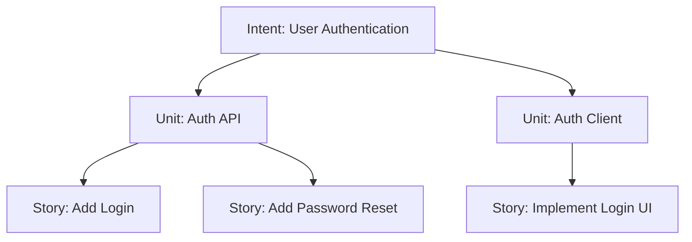
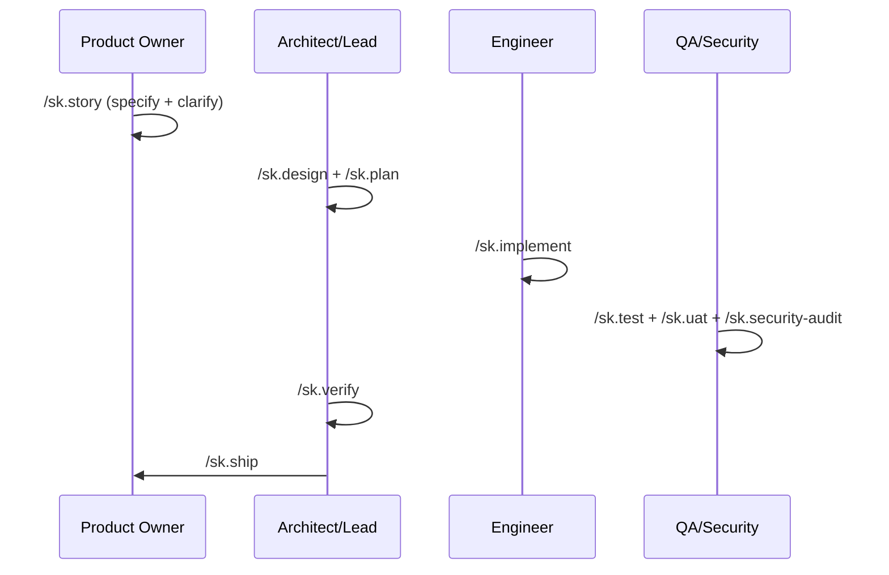

# 🚀 SpecKit-SSD-SDLC

> **The SDLC framework for AI-Native Engineering Teams.**

**SpecKit-SSD-SDLC** (Spec-Driven Development) provides a structured, high-fidelity process for cross-functional teams to collaborate with AI agents. It eliminates "hallucination-by-omission" by enforcing a strict hierarchy of truth from business intent to verified code.

---

## 📖 Table of Contents
- [🎯 The SpecKit Way (Philosophy)](#-the-speckit-way-philosophy)
- [⚡ Quick Start: Team Onramp](#-quick-start-team-onramp)
- [🎭 Role-Based Workflows](#-role-based-workflows)
- [📜 Command Reference](#-command-reference)
- [📦 Artifact Reference](#-artifact-reference)
- [🏗️ FAQ & Technical Details](#-faq--technical-details)

---

## 🎯 The SpecKit Way (Philosophy)

SpecKit is built on a single core principle: **Context is the currency of AI productivity.** 

Most AI failures occur because the model lacks context on *why* a decision was made. SpecKit solves this via:
1. **The Hierarchy of Truth**: Intent (Business Value) → Unit (Technical Domain) → Story (Atomic Task).
2. **Atomic Context Tiers**: 3-tiered Knowledge Bases that prevent LLM context-overflow.
3. **Spec-Aware Gates**: Every implementation step is validated against high-level specs before it can be shipped.

---

## ⚡ Quick Start: Team Onramp

### 1. Initialize for the Team
SpecKit is added as a **git subtree** so you can stay in sync with our upstream framework improvements.

```bash
git subtree add --prefix=.speckit https://github.com/ajorobert/SpecKit-SSD-SDLC master --squash
bash .speckit/setup.sh
/sk.init    # Runs interactive interview to build your .specify/memory files
```

### 2. Enter a Session
Every member of the team adopts a persona to unlock specialized commands:

```bash
/sk.session start --role {po | architect | lead | backend-engineer | frontend-engineer | security}
```

### 3. Set Your Focus
Agents work best when they have a laser-focus. Use `/sk.session focus` to lock onto a story.
```bash
/sk.session focus --story story-AUTH-001
```

---

## 🎭 Role-Based Workflows

SpecKit provides specialized "rails" for every team member. Follow the path for your role:

### 🖋️ Product Owner: From Intent to Story
Your goal is to define *what* gets built without getting bogged down in implementation.
1. **Capture Intent**: `/sk.story` — Decompose a business goal into Units and Stories.
2. **Clarify**: The agent will loop until the story meets the "Definition of Ready."
3. **Review Ready**: Use `/sk.session list` to see which stories are `ready` for the Architect.

> **🔍 Review Ritual:** Audit `intent.md` and `story-{ID}.md` in `specs/intents/{intent}/`. Ensure the **Acceptance Criteria** are measurable and match your original business goal.

### 📐 Architect: From Requirement to Contract
Your goal is to ensure technical consistency across services.
1. **Design**: `/sk.design` — Generate the `architecture.md`, `data-model.md`, and `API contracts`.
2. **ADR**: `/sk.adr` — Record significant technical decisions.
3. **Guide**: The routing `guide.yaml` is auto-generated to keep future developers oriented.

> **🔍 Review Ritual:** Audit `architecture.md` and `api-spec.json` in `specs/intents/**/units/{unit}/`. Verify that the **Domain Boundaries** are respected and that the data model doesn't create circular dependencies.

### 💻 Engineer: From Plan to Code
Your goal is high-quality implementation with zero technical debt.
1. **Plan**: `/sk.plan` — Generate a story-level technical implementation plan.
2. **Implement**: `/sk.implement` — Follow the plan's checklist to write code and tests.
3. **Review**: `/sk.review` — Perform a spec-aware self-review before submitting.

> **🔍 Review Ritual:** Audit `plan.md` and `tasks.yaml` in `specs/intents/**/stories/{ID}/`. Check `history/prompts/` for any novel tradeoffs recorded during complex implementations.

### 🛡️ QA & Security: The Quality Gate
Your goal is to certify that the work meets the team's standards.
1. **Verify Contracts**: `/sk.test` — Run provider/consumer contract tests.
2. **UAT**: `/sk.uat` — Perform acceptance testing against the criteria in the story.
3. **Audit**: `/sk.security-audit` — Run OWASP/STRIDE scans before shipping.

> **🔍 Review Ritual:** Audit `test-plan.md` in `specs/intents/**/contracts/` and `security-audit.md` in root. Verify that **all** Acceptance Criteria have mapped tests and no CRITICAL vulnerabilities are open.

---

### 3. Understand the Hierarchy & Session Focus

SpecKit organizes work into a strict top-down structure:
- **Intent**: A high-level business goal or feature (e.g., *User Authentication*).
- **Unit**: A specific technical bounded context or service (e.g., *Auth API*).
- **Story**: A single developer task or atomic slice of work (e.g., *Add password reset endpoint*).



**How do commands know what to work on?**
You use `/sk.session focus` to lock your agent onto a specific level. SpecKit saves this in a local `.claude/session.yaml` file. Every `/sk.*` command automatically reads this file, so the agent intrinsically knows which story or unit it is modifying without you having to repeatedly specify it.

**How do you move from Intent to Story?**
1. Run `/sk.story` on an **Intent**—the agent will autonomously decompose it into **Units** and **Stories**, and loop through clarification until the output meets completeness requirements.
2. Shift your focus downward using your session to execute the actual technical work:

```bash
/sk.session focus --intent user-auth               # Focus high-level for /sk.impact
/sk.session focus --unit auth-api                  # Shift focus downward for /sk.architecture
/sk.session focus --story story-AUTH-API-001       # Shift focus to the exact ticket for /sk.plan and /sk.implement
```

> **💡 Where do these names come from?**
> The `/sk.story` command automatically generates these tracking IDs, names, and their corresponding markdown files under `specs/intents/` when you outline and decompose work. 
> 
> **📊 How do I check story statuses?**
> Run `/sk.session list` to get a live dashboard view of all stories and their current workflow phase (e.g., `draft`, `in-progress`, `review`, `done`).

### 4. Run the SDLC



Commands marked `[optional]` are skippable. Commands marked `[conditional]` are required only in certain cases. Everything else is mandatory.

```
── SPECIFY ──────────────────────────────────────────────────────────────────────
/sk.story                ← capture intent → units → stories; ensures completeness via clarify loop (po)
                           --bug flag: bug report framing (expected/actual/repro) instead of user story
/sk.story --specify      ← [targeted] run Capture phase only: interview matrix → decomposition (po)
/sk.story --clarify      ← [targeted] run Clarify loop: resolves ambiguities via architect/po (architect/lead)
[/sk.impact]             ← [optional] assess blast radius on existing services (architect)

── ARCHITECTURE ─────────────────────────────────────────────────────────────────
/sk.design               ← full design pipeline: architecture → data model → API contracts (architect)
                           [conditional: runs based on unit stories and checkpoint mode]
[/sk.adr]                ← [optional] record a significant architecture decision (architect)

── PLAN ─────────────────────────────────────────────────────────────────────────
/sk.plan                 ← unit-level technical implementation plan and cross-story analysis (lead)
[/sk.knowledge-base]     ← [optional] generate or update knowledge base tiers (architect)

── FAST TRACK ───────────────────────────────────────────────────────────────────
[/sk.ff]                 ← sk.story→architecture→plan in one shot (lead)
                           --bug flag: skips architecture step; runs sk.story --bug instead
[/sk.hotfix]             ← P0 incident fast path: plan→implement→ship (lead)

── IMPLEMENT ────────────────────────────────────────────────────────────────────
/sk.implement            ← define tasks and execute implementation phase-by-phase (backend/frontend)
[/sk.investigate]        ← [optional] spec-aware debugging when blocked (backend/frontend)
[/sk.perf]               ← [optional] performance profiling and optimization cycle (backend/frontend)
[/sk.migrate]            ← [optional] db migration lifecycle via expand/contract (backend)
[/sk.refactor]           ← [optional] scoped technical debt resolution (backend/frontend)
[/sk.phr]                ← [optional] record significant decisions or tradeoffs made (any)

── REVIEW & QUALITY ─────────────────────────────────────────────────────────────
[/sk.review]             ← [recommended] spec-aware code review: boundaries + contracts + ADRs (backend/frontend)
/sk.test                 ← generate & run contract + integration tests (backend-qa/frontend-qa)
[/sk.uat]                ← [conditional: frontend work] user acceptance testing by platform (frontend-qa)
                           --platform web   → Playwright/Cypress (Next.js)
                           --platform mobile → Maestro/Detox (React Native) — no browser tooling
                           --platform admin  → Playwright/Cypress (React Admin)
/sk.security-audit       ← OWASP Top 10 + STRIDE audit, secrets scan (security)
/sk.verify               ← PASS/FAIL across all quality gates — must pass before ship (architect/lead)
                           Gate 1: Spec (BCR/Stories) | Gate 2: Architecture (Entities/ADRs)
                           Gate 3: Plan (Contracts) | Gate 4: Implementation (Tasks/Standards)
                           Gate 5: Test (Contract/E2E) | Gate 6: Security (OWASP/Secrets)

── SHIP ─────────────────────────────────────────────────────────────────────────
/sk.ship                 ← quality-gated release; /sk.verify must pass (lead)
/sk.rollback             ← automated or manual rollback plan for a shipped story (lead)
```

---

## 📜 Command Reference

### 🛠️ Setup & Session
```text
/sk.init             ← Initialize/update project memory + constitution via interview (any)
/sk.session          ← Manage local session: start/end/focus/status/list/switch/restore (any)
```

### 📋 Specify & Plan
```text
/sk.story            ← Full cycle intent → story capture + validation loop (po)
/sk.story --specify  ← [Targeted] Capture intent → unit → story; --bug for bug report (po)
/sk.story --clarify  ← [Targeted] Resolve ambiguities [modes: --po | --architect] (po/architect/lead)
/sk.impact           ← Assess blast radius of proposed work (architect)
/sk.design           ← Full design pipeline: architecture → data model → API contracts → routing guide (architect)
/sk.plan             ← Unit-level technical implementation plan and validation (lead)
/sk.ff               ← Fast-forward: specify→clarify→architecture→plan; --bug skips architecture (lead)
/sk.hotfix           ← P0 incident fast path: plan→implement→ship (lead)
```

### 💻 Implement & Review
```text
/sk.implement        ← Define tasks and execute implementation phase-by-phase (backend/frontend)
/sk.refactor         ← Scoped technical debt resolution [no new behavior] (backend/frontend)
/sk.perf             ← Performance profiling, diagnosis, and optimization (backend/frontend)
/sk.migrate          ← Database migration lifecycle [expand/contract] (backend)
/sk.review           ← Spec-aware code review: boundaries + contracts + ADRs (backend/frontend)
```

### 🛡️ Quality & Security
```text
/sk.verify           ← PASS/FAIL quality gate across all gates [run after test, before ship] (architect/lead)
/sk.test             ← Generate & run contract + integration tests (QA agents)
/sk.uat              ← Acceptance testing by platform: --platform web|mobile|admin (frontend-qa)
/sk.security-audit   ← OWASP Top 10 + STRIDE audit, secrets scan (security)
/sk.investigate      ← Spec-aware debugging (backend/frontend)
```

### 📚 History & Knowledge
```text
/sk.knowledge-base   ← Generate or update knowledge base tier [size-limited per tier] (architect)
/sk.adr              ← Create Architecture Decision Record (architect)
/sk.phr              ← Record Prompt History for significant decisions (any)
```

### 🚀 Operations & Shipping
```text
/sk.ship             ← Quality-gated release: /sk.verify must pass (lead)
/sk.rollback         ← Rollback plan for a shipped story (lead)
```

---

## 📦 Artifact Reference

The framework generates several key artifacts across five categories to maintain AI context and process rigor.

### 1. Initialization & Standards (`.specify/`)
Created by `/sk.init` via an interactive interview, these act as project-wide guidelines.
- **`project-config.md`, `system-context.md`, `service-registry.md`**: Core identity and definitions.
- **`standards/*.md`**: Constraints for coding, APIs, and data.
- **`constitution.md`**: Non-negotiable constraints, tech philosophy, and deployment context. Generated by `/sk.init`; update via the `[8] constitution` menu option.

### 2. Requirements & Definition (`specs/intents/`)
Created by Product Owners using `/sk.story` to define *what* gets built.
- **`intent.md`**: A high-level business goal.
- **`unit-brief.md`**: A bounded context or specific service.
- **`story-{ID}.md`**: An atomic task with clear acceptance criteria.

### 3. System Design & Technical Planning
Generated by Architects and Tech Leads before coding begins.
- **`architecture.md` (via `/sk.design`)**: The structure and pattern for a specific unit.
- **`data-model.md` (via `/sk.design`)**: Formalizes entity schemas and database structures.
- **`contracts/api-spec.json` (via `/sk.design`)**: Defines API boundaries between backend and frontend. The accompanying `test-plan.md` has per-consumer sections (`### web`, `### mobile`, `### admin`) so contract changes surface which frontend is affected.
- **`plan.md` (via `/sk.plan`) & `tasks.yaml` (via `/sk.implement`)**: The technical approach and sequential checklist for implementation.

### 4. Knowledge & Historical Tracking (`history/` and `specs/`)
Ensures the framework remembers *why* decisions were made, and *where* to look.
- **`guide.yaml` (via `/sk.design`)**: Auto-generated 3-tier routing index (System, Domain, Unit) that tells agents exactly where to look for relevant code and modules before they start debugging.
- **`knowledge-base.md` (via `/sk.knowledge-base`)**: Caches non-derivable context at the System (≤300 lines), Domain (≤250 lines), or Unit (≤150 lines) tier. Content exceeding a tier's limit is automatically extracted to the next tier down.
- **`ADR-{NNN}.md` (via `/sk.adr`)**: Architecture Decision Records capturing context, options, and justification for significant tech choices.
- **`PHR-{NNN}-{date}.md` (via `/sk.phr`)**: Prompt History Records to save highly effective AI prompts for future reuse.

### 5. Implementation & QA
Created by Developers or QA/Security agents executing the plan.
- **`src/**` (via `/sk.implement`)**: The actual implementation code and completed `tasks.md` checklist.
- **`tests/**` (via `/sk.test`)**: Contract, E2E, and unit test suites.
- **`security-audit.md` (via `/sk.security-audit`)**: An OWASP/STRIDE vulnerability report.

---

---

## 🏗️ FAQ & Technical Details

<details>
<summary><strong>❓ FAQ: Why all the files?</strong></summary>

SpecKit generates many artifacts (`intent.md`, `architecture.md`, `tasks.yaml`, etc.) to solve "LLM context drift." By breaking technical debt and business intent into atomic, small files, we ensure that every AI interaction is focused on the minimum required context, significantly increasing the reliability of the output.

</details>

<details>
<summary><strong>❓ FAQ: Do I need gstack?</strong></summary>

No. SpecKit is platform-neutral. However, [gstack](https://github.com/garrytan/gstack) is highly recommended for frontend teams as it enables visual design mocking (`/design-shotgun`) and real browser UAT loops which SpecKit uses natively if detected.

</details>

<details>
<summary><strong>❓ FAQ: How do I upgrade SpecKit?</strong></summary>

Since SpecKit is added as a git subtree, upgrades are simple:
```bash
git subtree pull --prefix=.speckit https://github.com/ajorobert/SpecKit-SSD-SDLC master --squash
bash .speckit/setup.sh
```

</details>

---

<details>
<summary><strong>🏗️ Execution Layer & Memory Structure</strong></summary>

- **Foundation**: Unified execution layer in `.claude/`.
- **Memory Layer (`.specify/memory/`)**:
  - `system-context.md`, `domain-model.md`, `service-registry.md`
  - `architecture-decisions.md` (ADR Index)
  - `command-rules.md` / `gemini-command-rules.md`
  - `standards/` (tech stack, coding, API, data standards)
- **Knowledge Base System (`specs/`)**: Tier 1 (System-level), Tier 2 (Domain-level), Tier 3 (Units) containing only non-derivable context.

</details>

<details>
<summary><strong>📈 Adaptive Checkpoints & Quality Gates</strong></summary>

### Checkpoint Modes
Stories are classified by `sk.story` to govern execution speed:
- `autopilot`: No contract changes. `/sk.ff` runs end-to-end.
- `confirm`: New feature. Pause pending approval after `/sk.plan`.
- `validate`: Breaking changes/new service. Pauses after `/sk.architecture` **and** `/sk.plan`.

### The 6 Quality Gates (`/sk.verify`)
1. **Spec** - Acceptance criteria written, no missing dependencies.
2. **Architecture** - Stories covered, entities added, cross-service ADRs defined.
3. **Plan** - Contracts defined, checkpoint approvals cleared.
4. **Implementation** - All tasks checked off `[X]`, no standard violations.
5. **Test** - Contract & E2E tests passing.
6. **Security** - No CRITICAL findings, secrets scan clean.

</details>

<details>
<summary><strong>👥 Agent Personas</strong></summary>

- **`po`** - Defines spec intents, units, stories.
- **`architect`** - Oversees service design, data models, contracts, ADRs.
- **`lead`** - Implementation plans, task breakdowns.
- **`backend`** / **`frontend`** - Implementation executors.
- **`backend-qa`** / **`frontend-qa`** - Testing, contract validation.
- **`security`** - Audit, STRIDE, secrets scanning.

</details>
