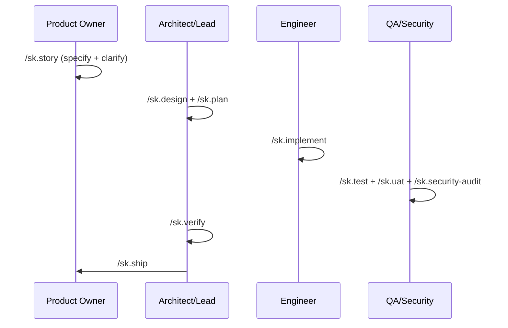

# 🚀 SpecKit-SSD-SDLC

> **The SDLC framework for AI-Native Engineering Teams.**

**SpecKit-SSD-SDLC** (Spec-Driven Development) provides a structured, high-fidelity process for cross-functional teams to collaborate with AI agents. It eliminates "hallucination-by-omission" by enforcing a strict hierarchy of truth from business intent to verified code.

---

## 📖 Table of Contents
- [🎯 The SpecKit Way (Philosophy)](#-the-speckit-way-philosophy)
- [⚡ Quick Start: Team Onramp](#-quick-start-team-onramp)
- [🎭 Role-Based Workflows](#-role-based-workflows)
- [📜 Command Reference](#-command-reference)
- [📦 Artifact Reference](#-artifact-reference)
- [🏗️ FAQ & Technical Details](#-faq--technical-details)

---

## 🎯 The SpecKit Way (Philosophy)

SpecKit is built on a single core principle: **Context is the currency of AI productivity.** 

Most AI failures occur because the model lacks context on *why* a decision was made. SpecKit solves this via:
1. **The Unit Lifecycle**: work is organised Intent → Unit → Story. Each **unit** (a feature) is the lifecycle container — its `stories/` plus numbered phase folders flow `stories → 02-design → 03-plan → 04-implementation → 05-test → 06-uat → 07-security-audit` to release readiness.
2. **Project-Aware Memory**: a `.specify/memory/projects/` router maps each detected project (backend / frontend / mobile / library) to its code root, so design, plan, implement, and test are scoped per project — one story can span many projects.
3. **Atomic Context Tiers**: layered Knowledge Bases that prevent LLM context-overflow.
4. **Spec-Aware Gates**: every implementation step is validated against high-level specs before it can be shipped.

> The canonical layout and path-resolution rules live in [`.specify/memory/standards/story-lifecycle.md`](.specify/memory/standards/story-lifecycle.md). The legacy `specs/intents/{intent}/units/{unit}/` hierarchy still resolves for read and is migrated non-destructively.

---

## ⚡ Quick Start: Team Onramp

### 1. Initialize for the Team
SpecKit is added as a **git subtree** so you can stay in sync with our upstream framework improvements.

```bash
git subtree add --prefix=.speckit https://github.com/ajorobert/SpecKit-SSD-SDLC master --squash
bash .speckit/setup.sh
/reload-skills
/sk.init    # Scans your repo, builds .specify/memory/projects/* (router + per-project) and shared standards
```

`/sk.init` auto-detects every project, classifies it (`backend | frontend | mobile | library`), and writes the project memory router `.specify/memory/projects/index.md` plus per-project `{project,tech-stack,coding-standards}.md` and shared `standards/{api,data,observability}-standards.md`.

### 2. Enter a Session
Every member of the team adopts a persona to unlock specialized commands. A single session can carry **multiple roles** (switch with `/sk.session switch --role`), and one feature branch represents one **unit** (the feature):

```bash
/sk.session start --role {po | architect | lead | backend | frontend | security}
```

`/sk.session start` branches from `dev` (override allowed) using the convention `feature/{intent-id}/{unit}-{YYYYMMDD}` — e.g. `feature/001-authentication/login-20260624`.

### 3. Set Your Focus
Agents work best with a laser focus. Use `/sk.session focus` to lock onto the active **unit**; every `/sk.*` command then resolves its `UNIT_DIR` automatically.
```bash
/sk.session focus --unit 001-authentication/login
```

---

## 🎭 Role-Based Workflows

SpecKit provides specialized "rails" for every team member. Follow the path for your role:

### 🖋️ Product Owner: From Goal to Story
Your goal is to define *what* gets built without getting bogged down in implementation.
1. **Capture Story**: `/sk.story` — Turn a business goal into one independent story.
2. **Clarify**: The agent will loop until the story meets the "Definition of Ready."
3. **Review Ready**: Use `/sk.session list` to see which stories are `ready` for the Architect.

> **🔍 Review Ritual:** Audit the per-layer story files in `specs/intents/{intent}/units/{unit}/stories/`. Ensure each story's **Acceptance Criteria** are measurable and match your original business goal.

### 📐 Architect: From Requirement to Contract
Your goal is to ensure technical consistency across services.
1. **Design**: `/sk.design` — Generate `architecture.md`, `impact-analysis.md`, `api-contract.md`, `database-design.md`, plus a per-project impact file under `02-design/projects/`.
2. **ADR**: `/sk.adr` — Record significant technical decisions.
3. **Guide**: The routing `guide.yaml` is auto-generated to keep future developers oriented.

> **🔍 Review Ritual:** Audit `02-design/architecture.md`, `api-contract.md`, and the `02-design/projects/{Project}.md` impact files under `specs/intents/{intent}/units/{unit}/`. Verify that **Domain Boundaries** are respected and the data model doesn't create circular dependencies.

### 💻 Engineer: From Plan to Code
Your goal is high-quality implementation with zero technical debt. Work is **project-scoped**:
1. **Plan**: `/sk.plan --role backend --project Backend.API` — Generate a per-project plan (`03-plan/{Project}/`).
2. **Implement**: `/sk.implement --project Backend.API` — Write code; track in `04-implementation/{Project}/`.
3. **Review**: `/sk.review` — Perform a spec-aware self-review before submitting.

> **🔍 Review Ritual:** Audit `03-plan/{Project}/{plan,tasks,checklist}.md` and `04-implementation/{Project}/validation.md`. Check `history/prompts/` for any novel tradeoffs recorded during complex implementations.

### 🛡️ QA & Security: The Quality Gate
Your goal is to certify that the work meets the team's standards.
1. **Verify Contracts**: `/sk.test --project Backend.API` — Run provider/consumer/integration tests (`05-test/{Project}/`).
2. **UAT**: `/sk.uat` — Acceptance testing against each story file's acceptance criteria (`06-uat/`).
3. **Audit**: `/sk.security-audit` — OWASP/STRIDE/dependency scans (`07-security-audit/`) before shipping.

> **🔍 Review Ritual:** Audit `05-test/{Project}/` docs and `07-security-audit/{owasp-report,stride-review,dependency-scan,security-signoff}.md`. Verify that **all** Acceptance Criteria have mapped tests and no CRITICAL vulnerabilities are open.

---

### 3. Understand the Unit Lifecycle & Session Focus

SpecKit organizes work Intent → Unit → Story. Each **unit** (a feature, e.g. *login* under *Authentication*) is the lifecycle container: `stories/` plus numbered phase folders. Planning, implementation, and testing are **project-scoped** — a unit can span many projects, and carries one story per layer:


```mermaid
graph TD
    Intent[001-authentication] --> Unit[units/login]
    Unit --> S[stories/ &#40;Frontend/Backend/Mobile&#41;]
    S --> P2[02-design]
    P2 --> P3[03-plan/&#123;Project&#125;]
    P3 --> P4[04-implementation/&#123;Project&#125;]
    P4 --> P5[05-test/&#123;Project&#125;]
    P5 --> P6[06-uat]
    P6 --> P7[07-security-audit]
    P3 -.-> Backend[Backend.API]
    P3 -.-> Web[Customer.Web]
    P3 -.-> Mobile[Mobile.App]
```

**How do commands know what to work on?**
You use `/sk.session focus` to lock your agent onto the active **unit**. SpecKit saves this in a local `.claude/session.yaml` file (`active_intent_id` + `active_unit_id` + `unit_dir`). Every `/sk.*` command reads it and resolves its `UNIT_DIR` automatically, so the agent knows which unit — and, with `--project`, which project — it is modifying without you repeating yourself.

**How do you move from goal to code?**
1. `/sk.intent` → define the business capability (`intent.md`).
2. `/sk.unit` → define the feature, its impacted projects, and user flows (`unit-brief.md`).
3. `/sk.story` → capture one story per impacted layer into `stories/`.
4. Run each phase, scoping engineering phases by project:

```bash
/sk.session focus --unit 001-authentication/login        # Lock onto the unit for every /sk.* command
/sk.plan --role backend --project Backend.API            # Per-project plan → 03-plan/Backend.API/
/sk.implement --project Backend.API                      # Per-project code → 04-implementation/Backend.API/
```

> **💡 Where do these names come from?**
> `/sk.intent` mints the `{NNN}-{name}` intent id; `/sk.unit` names the unit and records impacted projects; `/sk.story` names each story `story-{Layer}-{INTENT}-{UNIT}-{NNN}.md`. Project names come from `.specify/memory/projects/index.md`, written by `/sk.init`.
>
> **📊 How do I check statuses?**
> Run `/sk.session list` for a live dashboard of all units/stories and their current workflow phase.

### 4. Run the SDLC


```mermaid
sequenceDiagram
    participant PO as Product Owner
    participant AR as Architect/Lead
    participant DEV as Engineer
    participant QA as QA/Security

    PO->>PO: /sk.story (specify + clarify)
    AR->>AR: /sk.design + /sk.plan
    DEV->>DEV: /sk.implement
    QA->>QA: /sk.test + /sk.uat + /sk.security-audit
    AR->>AR: /sk.verify
    AR->>PO: /sk.ship
```

Commands marked `[optional]` are skippable. Commands marked `[conditional]` are required only in certain cases. Everything else is mandatory.

```
── SPECIFY (intent → unit → stories/) ──────────────────────────────────────────────
/sk.intent               ← define a business capability → specs/intents/{NNN}-{name}/intent.md (po)
/sk.unit                 ← define a feature/unit under the intent → units/{unit}/unit-brief.md (po/lead)
/sk.story                ← capture one story per impacted layer → stories/story-{Layer}-{ID}.md (po)
                           --bug flag: bug report framing (expected/actual/repro) instead of user story
/sk.story --specify      ← [targeted] run Capture phase only: interview matrix → story files (po)
/sk.story --clarify      ← [targeted] run Clarify loop: resolves ambiguities via architect/po (architect/lead)
[/sk.impact]             ← [optional] assess blast radius on existing services (architect)

── ARCHITECTURE (02-design) ───────────────────────────────────────────────────────
/sk.design               ← full design pipeline: architecture + impact-analysis + api-contract
                           + database-design + per-project impact files (architect)
                           [conditional: runs based on story scope and checkpoint mode]
[/sk.adr]                ← [optional] record a significant architecture decision (architect)

── PLAN (03-plan/{Project}) ───────────────────────────────────────────────────────
/sk.plan                 ← per-project plan (--role/--project) + cross-project analysis (lead)
                           writes 03-plan/{Project}/{plan,tasks,checklist,jira-subtask,estimation}.md
[/sk.knowledge-base]     ← [optional] generate or update knowledge base tiers (architect)

── FAST TRACK ───────────────────────────────────────────────────────────────────
[/sk.ff]                 ← sk.story→design→plan in one shot (lead)
                           --bug flag: skips architecture step; runs sk.story --bug instead
[/sk.hotfix]             ← P0 incident fast path: plan→implement→ship (lead)

── IMPLEMENT (04-implementation/{Project}) ────────────────────────────────────────
/sk.implement            ← execute implementation per project; track in 04-implementation/{Project} (backend/frontend)
[/sk.investigate]        ← [optional] spec-aware debugging when blocked (backend/frontend)
[/sk.perf]               ← [optional] performance profiling and optimization cycle (backend/frontend)
[/sk.migrate]            ← [optional] db migration lifecycle via expand/contract (backend)
[/sk.refactor]           ← [optional] scoped technical debt resolution (backend/frontend)
[/sk.phr]                ← [optional] record significant decisions or tradeoffs made (any)

── REVIEW & QUALITY (05-test / 06-uat / 07-security-audit) ────────────────────────
[/sk.review]             ← [recommended] spec-aware code review: boundaries + contracts + ADRs (backend/frontend)
/sk.test                 ← per-project tests → 05-test/{Project}/ (backend-qa/frontend-qa)
                           backend/library → unit + integration + contract; frontend/mobile → component + contract
[/sk.uat]                ← [conditional: frontend work] UAT vs stories/ acceptance criteria → 06-uat/ (frontend-qa)
                           --platform web   → Playwright/Cypress (Next.js)
                           --platform mobile → Maestro/Detox (React Native) — no browser tooling
                           --platform admin  → Playwright/Cypress (React Admin)
/sk.security-audit       ← OWASP + STRIDE + dependency scan → 07-security-audit/ (security)
/sk.verify               ← PASS/FAIL across all quality gates — must pass before ship (architect/lead)
                           Gate 1: Spec (BCR/Stories) | Gate 2: Architecture (Entities/ADRs)
                           Gate 3: Plan (Contracts) | Gate 4: Implementation (Tasks/Standards)
                           Gate 5: Test (Contract/E2E) | Gate 6: Security (OWASP/Secrets)

── SHIP ─────────────────────────────────────────────────────────────────────────
/sk.ship                 ← quality-gated release; /sk.verify must pass (lead)
/sk.rollback             ← automated or manual rollback plan for a shipped story (lead)
```

---

## 📜 Command Reference

### 🛠️ Setup & Session
```text
/sk.init             ← Scan repo → project memory (projects/index.md + per-project) + shared standards + constitution (any)
/sk.session          ← Manage local session: start/end/focus --unit|--story/status/list/switch/restore (any)
```

### 📋 Specify & Plan
```text
/sk.intent           ← Define a business capability → specs/intents/{NNN}-{name}/intent.md (po)
/sk.unit             ← Define a feature/unit (boundary, flows, impacted projects) → unit-brief.md (po/lead)
/sk.story            ← Capture one story per impacted layer into the unit's stories/ (po)
/sk.story --specify  ← [Targeted] Capture phase only → story files; --bug for bug report (po)
/sk.story --clarify  ← [Targeted] Resolve ambiguities [modes: --po | --architect] (po/architect/lead)
/sk.impact           ← Assess blast radius of proposed work (architect)
/sk.design           ← Full design pipeline → 02-design/: architecture + impact-analysis + api-contract + database-design + per-project (architect)
/sk.plan             ← Per-project plan (--role/--project) → 03-plan/{Project}/ + cross-project analysis (lead)
/sk.ff               ← Fast-forward: story→design→plan; --bug skips architecture (lead)
/sk.hotfix           ← P0 incident fast path: plan→implement→ship (lead)
```

### 💻 Implement & Review
```text
/sk.implement        ← Per-project implementation → 04-implementation/{Project}/ (--project) (backend/frontend)
/sk.refactor         ← Scoped technical debt resolution [no new behavior] (backend/frontend)
/sk.perf             ← Performance profiling, diagnosis, and optimization (backend/frontend)
/sk.migrate          ← Database migration lifecycle [expand/contract] (backend)
/sk.review           ← Spec-aware code review: boundaries + contracts + ADRs (backend/frontend)
```

### 🛡️ Quality & Security
```text
/sk.verify           ← PASS/FAIL quality gate across all gates [run after test, before ship] (architect/lead)
/sk.test             ← Per-project tests → 05-test/{Project}/ (--project) (QA agents)
/sk.uat              ← Acceptance testing vs stories/ acceptance criteria → 06-uat/: --platform web|mobile|admin (frontend-qa)
/sk.security-audit   ← OWASP + STRIDE + dependency scan → 07-security-audit/ (security)
/sk.investigate      ← Spec-aware debugging (backend/frontend)
```

### 📚 History & Knowledge
```text
/sk.knowledge-base   ← Generate or update knowledge base tier [size-limited per tier] (architect)
/sk.adr              ← Create Architecture Decision Record (architect)
/sk.phr              ← Record Prompt History for significant decisions (any)
```

### 🚀 Operations & Shipping
```text
/sk.ship             ← Quality-gated release: /sk.verify must pass (lead)
/sk.rollback         ← Rollback plan for a shipped story (lead)
```

---

## 📦 Artifact Reference

Two artifact trees: **project memory** (`.specify/memory/`, written once by `/sk.init` and updated as projects evolve) and the **unit lifecycle** (`specs/intents/{intent}/units/{unit}/`, one container per feature with `stories/` plus numbered phase folders).

### 1. Project Memory & Standards (`.specify/memory/`)
Created/maintained by `/sk.init` — a repo scan plus interview.
- **`projects/index.md`**: the **router** — one row per detected project (`project | type | code-root`), where `type ∈ backend | frontend | mobile | library`. Always loaded so every skill knows which projects exist and where their code lives.
- **`projects/{ProjectName}/{project,tech-stack,coding-standards}.md`**: per-project identity, stack, and rules.
- **`standards/{api,data,observability}-standards.md`**: shared, cross-project standards.
- **`standards/story-lifecycle.md`**: canonical directory layout + path-resolution + branch + migration rules.
- **`project-config.md`, `system-context.md`, `service-registry.md`, `constitution.md`**: core identity, definitions, and non-negotiable constraints (constitution via the `[8]` menu).

### 2. The Unit Lifecycle (`specs/intents/{intent}/units/{unit}/`)
`/sk.intent` writes `intent.md`; `/sk.unit` writes `unit-brief.md`. Below that, each phase is owned by one command. Engineering phases (03/04/05) are **project-scoped** — one subfolder per participating project.

| Phase | Command | Artifacts |
|---|---|---|
| `stories/` | `/sk.story` | `story-{Layer}-{INTENT}-{UNIT}-{NNN}.md` (one per layer; AC inside), `jira.md` (optional) |
| `02-design/` | `/sk.design` | `architecture.md`, `impact-analysis.md`, `api-contract.md`, `database-design.md`, `projects/{Project}.md` |
| `03-plan/{Project}/` | `/sk.plan` | `plan.md`, `tasks.md`, `checklist.md`, `jira-subtask.md`, `estimation.md` |
| `04-implementation/{Project}/` | `/sk.implement` | `implementation.md`, `progress.md`, `validation.md` (+ code under the project's `code-root`) |
| `05-test/{Project}/` | `/sk.test` | backend/library → `unit-test.md`, `integration-test.md`, `contract-test.md` · frontend/mobile → `component-test.md`, `contract-test.md` |
| `06-uat/` | `/sk.uat` | `acceptance-result.md`, `user-flow-test.md`, `signoff.md` |
| `07-security-audit/` | `/sk.security-audit` | `owasp-report.md`, `stride-review.md`, `dependency-scan.md`, `security-signoff.md` |

### 3. Knowledge & Historical Tracking (`history/` and `specs/`)
Ensures the framework remembers *why* decisions were made, and *where* to look.
- **`guide.yaml` (via `/sk.design`)**: Auto-generated routing index that tells agents where to look for relevant code before debugging.
- **`knowledge-base.md` (via `/sk.knowledge-base`)**: Caches non-derivable context at the System (≤300 lines), Domain (≤250 lines), or Unit (≤150 lines) tier. Content exceeding a tier's limit is extracted to the next tier down.
- **`ADR-{NNN}.md` (via `/sk.adr`)**: Architecture Decision Records capturing context, options, and justification.
- **`PHR-{NNN}-{date}.md` (via `/sk.phr`)**: Prompt History Records that save highly effective AI prompts for reuse.

> **Backward compatibility:** the legacy `specs/intents/{intent}/units/{unit}/stories/...` artifacts (`intent.md`, `unit-brief.md`, `story-{ID}.md`, `data-model.md`, `tasks.yaml`, `security-audit.md`) still resolve for read and are migrated into the phase folders non-destructively (copy, never delete).

---

---

## 🏗️ FAQ & Technical Details

<details>
<summary><strong>❓ FAQ: Why all the files?</strong></summary>

SpecKit generates many artifacts (`story.md`, `architecture.md`, `tasks.md`, etc.) across the seven story phases to solve "LLM context drift." By breaking business intent and technical work into atomic, small files, we ensure that every AI interaction is focused on the minimum required context, significantly increasing the reliability of the output.

</details>

<details>
<summary><strong>❓ FAQ: Do I need gstack?</strong></summary>

No. SpecKit is platform-neutral. However, [gstack](https://github.com/garrytan/gstack) is highly recommended for frontend teams as it enables visual design mocking (`/design-shotgun`) and real browser UAT loops which SpecKit uses natively if detected.

</details>

<details>
<summary><strong>❓ FAQ: How do I upgrade SpecKit?</strong></summary>

Since SpecKit is added as a git subtree, upgrades are simple:
```bash
git subtree pull --prefix=.speckit https://github.com/ajorobert/SpecKit-SSD-SDLC master --squash
bash .speckit/setup.sh
```

</details>

---

<details>
<summary><strong>🏗️ Execution Layer & Memory Structure</strong></summary>

- **Foundation**: Unified execution layer in `.claude/`.
- **Memory Layer (`.specify/memory/`)**:
  - `projects/index.md` (router) + `projects/{ProjectName}/{project,tech-stack,coding-standards}.md`
  - `system-context.md`, `domain-model.md`, `service-registry.md`
  - `architecture-decisions.md` (ADR Index)
  - `standards/` (api, data, observability standards + `story-lifecycle.md` canonical layout/path reference)
- **Unit Lifecycle (`specs/intents/{intent}/units/{unit}/`)**: `stories/` + numbered phase folders (`02-design` … `07-security-audit`); 03/04/05 are project-scoped.
- **Knowledge Base System (`specs/`)**: Tier 1 (System-level), Tier 2 (Domain-level), Tier 3 (Unit, in `02-design/knowledge-base.md`) containing only non-derivable context.

</details>

<details>
<summary><strong>📈 Adaptive Checkpoints & Quality Gates</strong></summary>

### Checkpoint Modes
Stories are classified by `sk.story` to govern execution speed:
- `autopilot`: No contract changes. `/sk.ff` runs end-to-end.
- `confirm`: New feature. Pause pending approval after `/sk.plan`.
- `validate`: Breaking changes/new service. Pauses after `/sk.architecture` **and** `/sk.plan`.

### The 6 Quality Gates (`/sk.verify`)
1. **Spec** - Acceptance criteria written, no missing dependencies.
2. **Architecture** - Stories covered, entities added, cross-service ADRs defined.
3. **Plan** - Contracts defined, checkpoint approvals cleared.
4. **Implementation** - All tasks checked off `[X]`, no standard violations.
5. **Test** - Contract & E2E tests passing.
6. **Security** - No CRITICAL findings, secrets scan clean.

</details>

<details>
<summary><strong>👥 Agent Personas</strong></summary>

- **`po`** - Defines spec intents, units, stories.
- **`architect`** - Oversees service design, data models, contracts, ADRs.
- **`lead`** - Implementation plans, task breakdowns.
- **`backend`** / **`frontend`** - Implementation executors.
- **`backend-qa`** / **`frontend-qa`** - Testing, contract validation.
- **`security`** - Audit, STRIDE, secrets scanning.

</details>

<details>
<summary><strong>📊 Prompt-Cache Optimization & Telemetry</strong></summary>

SpecKit is tuned for Anthropic's prefix-based prompt cache (5-min TTL, up to 4 `cache_control` breakpoints). Skills layer injected files by volatility so common context stays in the cacheable prefix while story- and iteration-specific content goes in the tail.

### Tier Model
- **Tier A — Framework invariant**: governance + standards + system-context + ADRs + design-principles. Changes weekly.
- **Tier B — Domain/project invariant**: domain-model, service-registry, `projects/index.md`, per-project standards, `02-design/*`, tech-stack packs. Stable across a dev's iteration loop.
- **Tier C — Story invariant**: the focused `stories/story-{Layer}-{ID}.md` + `03-plan/{Project}/plan.md`. Stable across 3–10 dev iterations on the same story.
- **Tier D — Iteration tail**: diff, test output, review notes, user input, session-derived scalars (`active_intent_id`, `active_unit_id`, `active_story_id`, `unit_dir`, `role`).

"Dynamic" is relative to the caller's loop: a story file is Tier D for a PO hopping stories but Tier C for a dev grinding one story.

### Canonical inject_files order (all sk.* skills)
`governance rules → standards → system-context → ADRs → domain-model → service-registry → design-principles → tech-pack` → (cache boundary) → tail wrapper containing story/plan/review-notes/user input.

`session.yaml` is **not** in any skill's `inject_files` (except `sk.session` itself). Skills `Read` it at runtime so its contents land in Tier D naturally.

### Telemetry hook
A `Stop` hook ([.claude/hooks/log-cache-metrics.sh](.claude/hooks/log-cache-metrics.sh)) appends one JSONL row per assistant turn to `.claude/cache-metrics.jsonl`. Captured fields: `timestamp, sessionId, model, skill_name, active_story_id, role, cache_read, cache_creation, input_tokens, output_tokens, gitBranch, cwd`. Zero token cost — pure local file I/O reading the transcript the harness already writes.

### Reading the metrics
```bash
bash .claude/hooks/cache-metrics-report.sh                  # overall + by-skill + by-role hit rate
bash .claude/hooks/cache-metrics-report.sh tail 20          # last 20 turns, raw
bash .claude/hooks/cache-metrics-report.sh since 2026-04-24  # rows since date
```
Hit rate = `cache_read / (cache_read + cache_creation + input_tokens)`. Sustained low hit rate on consecutive same-role calls indicates a prefix-stability regression.

</details>
